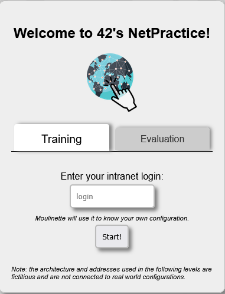
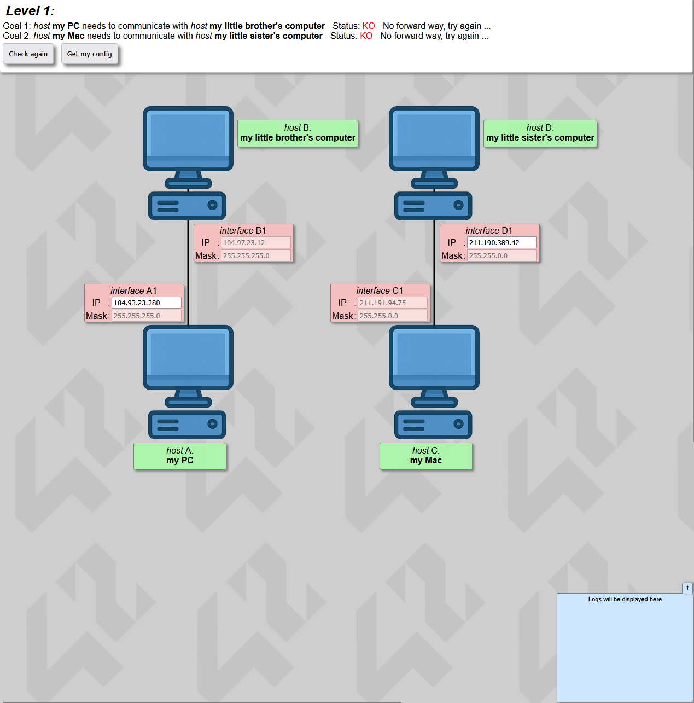
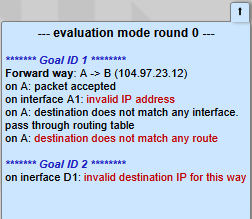

*This project has been created as part of the 42 curriculum by danfern3*

# Description
This projects aims to introduce you to net configuration.

During the correction, you must complete 3 random exercises in under 15 minutes.

# Instructions
### Execution
Download the resources provided in the project page and extract them into any folder of your choice.

Open the 'index.html' using a web browers, then you will be prompted with the following image

Choose either *Training* or *Evaluation*. Then add your intra 42 *login* (if required) and press the button *Start*.

The next image shows an example of the exercises, further leves have Routers, Switches and connections to the Internet.

Click the *Check again* button to verify if the configuration is correct or not. If there is any error, the problem will be displayed in the bottom-right corner of the window, as shown below.

Click the *Get my config* button to download the configuration whenever you need to. It will be usefull to turn in the assignment.

Click the *Next level* button to continue to the next level. NOTE: this button will only appear when you have successfully completed a level.

### Submission details
In order to complete the project, the 10 levels must be completed and their configuration shold have been exported before continuing to the next level. This means that should be, additionally to README file, 10 configuration files. Otherwise, the project will be failed.

# Resources

### Use of AI
AI has been used to correct the syntax of this README file, contrast information and solve doubts related to the acquired concepts. Also it has been used to describe routers and switches, and to summarize OSI layers.

### TCP/IP addressing
The success of TCP/IP as the network protocol of the Internet is largely because of its ability to connect together networks of different sizes and systems of different types. These networks are arbitrarily defined into three main classes (along with a few others) that have predefined sizes. Each of them can be divided into smaller subnetworks by system administrators. A subnet mask is used to divide an IP address into two parts. One part identifies the host (computer), the other part identifies the network to which it belongs. To better understand how IP addresses and subnet masks work, look at an IP address and see how it's organized.

An IP address is a 32-bit number. It uniquely identifies a host (computer or other device, such as a printer or router) on a TCP/IP network

IP addresses are normally expressed in dotted-decimal format, with four numbers separated by periods, such as 192.168.123.132. To understand how subnet masks are used to distinguish between hosts, networks, and subnetworks, examine an IP address in binary notation.

For example, the dotted-decimal IP address 192.168.123.132 is (in binary notation) the 32-bit number 11000000101010000111101110000100. This number may be hard to make sense of, so divide it into four parts of eight binary digits.

### Subnet mask
The subnet mask is required for TCP/IP to work. The subnet mask is used by the TCP/IP protocol to determine whether a host is on the local subnet or on a remote network.

### Default gateway
If a TCP/IP computer needs to communicate with a host on another network, it will usually communicate through a device called a router. In TCP/IP terms, a router that is specified on a host, which links the host's subnet to other networks, is called a default gateway. This section explains how TCP/IP determines whether or not to send packets to its default gateway to reach another computer or device on the network.

When a host attempts to communicate with another device using TCP/IP, it performs a comparison process using the defined subnet mask and the destination IP address versus the subnet mask and its own IP address. The result of this comparison tells the computer whether the destination is a local host or a remote host.

If the result of this process determines the destination to be a local host, then the computer will send the packet on the local subnet. If the result of the comparison determines the destination to be a remote host, then the computer will forward the packet to the default gateway defined in its TCP/IP properties. It's then the responsibility of the router to forward the packet to the correct subnet.

### Routers and switches

#### Routers
Imagine your home or school is a small town, and the internet is a big city far away.

A router is like a post office or a traffic police officer.

The purpose of a router is to connect various networks, included the Internet.
#### Switches
Now imagine your house has many rooms, and each room has a device (computer, printer, TV).

A switch is like a smart power strip or a hallway helper inside the house.

The purpose of a switch is to connect devices inside the same network
### OSI layers
Here’s a **simple, kid-friendly but still correct** explanation of the **OSI Layers** that works well in a README 👍

---

## What Are OSI Layers?

Imagine sending a **letter** to a friend 📬.

To make sure the letter arrives correctly, many steps must happen:

* Writing the message
* Putting it in an envelope
* Choosing the address
* Sending it through roads
* Delivering it to the right person

Computers do the same thing when they send data.
The **OSI Model** is a way to **divide this job into 7 simple layers**, where each layer has **one clear responsibility**.

👉 Each layer helps the data move safely from one computer to another.

---

## The 7 OSI Layers (From Top to Bottom)

### 7️⃣ Application – *What the user uses*

This is the layer **people interact with**.

* Web browsers
* Email apps
* File transfer apps

📌 Example: Opening a website in your browser.

---

### 6️⃣ Presentation – *How data looks*

This layer makes sure data is:

* In the right format
* Compressed
* Encrypted (kept secret)

📌 Example: Turning data into a format all computers understand.

---

### 5️⃣ Session – *Keeping the conversation alive*

This layer:

* Starts the communication
* Keeps it running
* Ends it when done

📌 Example: Keeping you logged in while you browse a website.

---

### 4️⃣ Transport – *Safe delivery*

This layer makes sure data:

* Arrives completely
* Arrives in the right order
* Is resent if something is missing

📌 Example: Making sure all pieces of a file arrive correctly.

---

### 3️⃣ Network – *Finding the way*

This layer decides:

* Where data should go
* The best path to get there

📌 Example: Routers work mainly at this layer.

---

### 2️⃣ Data Link – *Local delivery*

This layer:

* Sends data to the right device on the same network
* Uses MAC addresses

📌 Example: Switches work mainly at this layer.

---

### 1️⃣ Physical – *The real wires*

This layer is about:

* Cables
* Signals
* Electricity or light

📌 Example: Ethernet cables, Wi-Fi signals.

---

## Easy Memory Trick 🧠

**“All People Seem To Need Data Processing”**

* Application
* Presentation
* Session
* Transport
* Network
* Data Link
* Physical

---

## Very Short Summary

* The **OSI model** has **7 layers**
* Each layer has **one job**
* Together, they help data move from one device to another

If you want, I can:

* Make it even simpler (for very young kids)
* Make it more technical (still README-friendly)
* Add a one-paragraph version

#### Links
+ [TCP/IP addressing](https://learn.microsoft.com/en-us/troubleshoot/windows-client/networking/tcpip-addressing-and-subnetting)